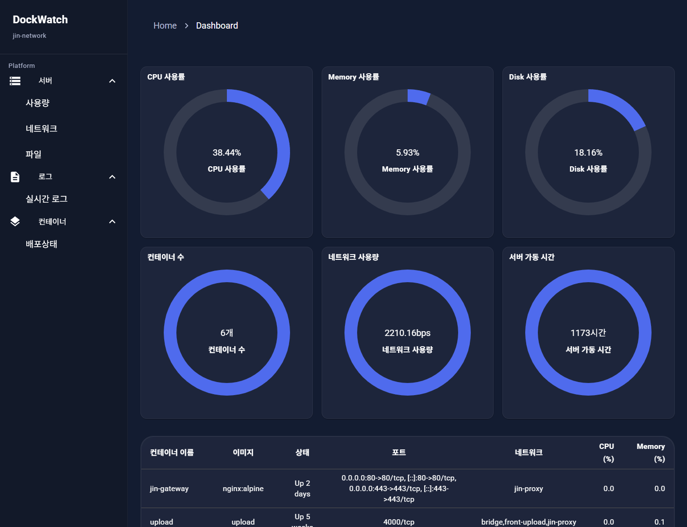
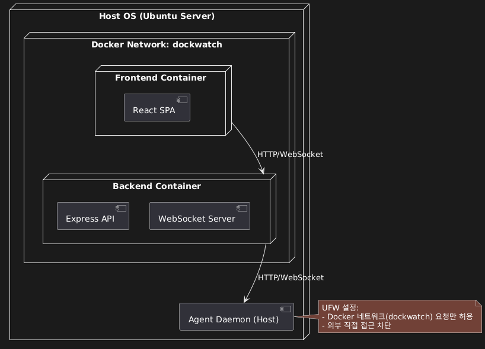
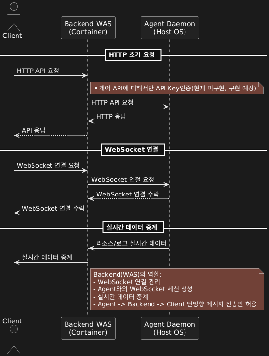

# 1. Dockwatch

**[ver: 1.0.0](https://github.com/jin7942/dockwatch/releases/tag/v1.0.0)**



다음 링크로 방문 하시면, 운영중인 페이지를 볼 수 있습니다. [**Dockwatch**](https://dockwatch.jin7942.co.kr)

Dockwatch는 컨테이너 및 서버 모니터링 시스템으로, 실시간 리소스 사용 현황, 실시간 로그 등을 한눈에 확인할 수 있는 솔루션입니다. 사용자가 컨테이너 및 서버의 상태를 시각적으로 관리하고 확인할 수 있도록 도와줍니다.

Dockwatch 프로젝트는 백엔드, 프론트, 에이전트로 구성되어 있으며, 에이전트는 별도 리포지토리로 관리하고 있습니다. 자세한 내용은 다음 링크를 방문 하십시오. [dockwatch-agent](https://github.com/jin7942/dockwatch-agent)

해당 프로젝트는 TypeScript + Express 로 제작 되었으며, 코드 컨벤션은 [typescript-nodejs-convention.md](https://github.com/jin7942/dev-guide/blob/main/typescript-nodejs-convention.md)를 따릅니다.

## 1.1. 주요 기능

-   서버 리소스 모니터링(CPU, Memory, Network 등)
-   컨테이너별 실시간 로그 제공
-   Client <-> WAS <-> Agent 아키텍처로 보안성 강화
-   컨테이너 정보 및 배포상태 제공

## 1.2. 기술스택

-   백엔드: Node.js, Express(REST API, WebSocket)
-   프론트엔드: React, Vite, Mui
-   운영환경: Ubuntu

## 1.3. 실행 방법

```bash
git clone https://github.com/jin7942/dockwatch
```

```bash
cd backend # or frontend
```

```bash
npm install
```

```bash
npm run dev
```

# 2. API 명세

모든 HTTP/WS 엔드포인트와 요청/응답 형식은 별도 문서인 [DOCUMENT.md](https://github.com/jin7942/dockwatch-agent/DOCUMENT.md)에 정리되어 있습니다.

# 3. 프로젝트 구조

**Dockwatch** 프로젝트는 프론트엔드, 백엔드, 에이전트로 구성되어 있습니다.

-   **Agent 데몬**은 서버 OS에서 실행되며, 실질적인 데이터 수집(리소스 사용량, 로그, 프로세스 정보 등)을 수행합니다.
-   **백엔드**는 Agent와 클라이언트 사이의 중계 역할을 수행하며, HTTP API와 WebSocket을 통해 클라이언트에 실시간 데이터를 제공합니다.
-   **프론트엔드**는 React로 제작된 SPA로 사용자에게 실시간 대시보드와 로그 뷰어 등을 제공합니다.

**시스템 보안을 위해**:

-   클라이언트는 백엔드에만 접근 가능하며, Agent는 백엔드에서만 접근 가능하도록 논리적으로 격리되어 있습니다.



## 3.1. 실행 흐름

**시퀀스 다이어그램**: Dockwatch의 Client-Backend-Agent 데이터 흐름

-   Backend는 WAS로서 중계 및 인증역할 수행
-   향후 인증 기능 구현 후 제어 기능 추가 예정
-   WebSocket은 Agent->Backend->Client 단방향 전송만 허용



## 3.2. 디렉터리 구조

**백엔드**

```bash
src/
├── app.ts                                  // 라우팅 및 미들웨어
├── index.ts                                // 실행 엔트리 포인트
├── common
│   ├── _config                             // 전역 설정 모음
│   │   └── constants.ts                    // 상수 모음
│   ├── error
│   │   ├── custom-error.ts                 // 커스텀 에러 클래스
│   │   └── error-handler.ts                // 전역 에러 핸들러
│   ├── middleware
│   │   ├── agent-api.ts                    // agent 호출 모듈
│   │   ├── async-handler.ts                // 전역 async 핸들러
│   │   └── verify-control-key.ts           // 인증 모듈
│   ├── types
│   │   ├── http-status.enum.ts             // HTTP 상태코드 enum
│   │   ├── response.vo.ts                  // HTTP 공통 응답 포멧
│   │   └── ws.vo.ts                        // WS 공통 응답 포멧
│   └── utils                               // 유틸 함수 모음
│       ├── create-util.ts
│       ├── parser-util.ts
│       └── ws-util.ts
├── container
│   ├── controller                          // 컨트롤러 클래스
│   │   ├── container-http.controller.ts
│   │   └── container-ws.controller.ts
│   ├── dto                                 // 데이터 전송용 객체 인터페이스
│   │   ├── container-http.dto.ts
│   │   └── container-http.vo.ts
│   ├── route                               // 라우팅
│   │   ├── container-http.route.ts
│   │   └── container-ws.route.ts
│   └── service                             // 서비스 클래스
│       └── container-http.service.ts
├── dashboard
│   ├── controller/
│   ├── dto/
│   ├── route/
│   └── service/
├── log
│   ├── controller/
│   ├── dto/
│   ├── route/
│   └── service/
├── server
│   ├── controller/
│   ├── dto/
│   ├── route/
│   └── service/
└── ws
    └── socket.ts
```

**프론트엔드**

```bash
src/
├── App.tsx
├── main.tsx                                // 실행 엔트리 포인트
├── common
│   ├── _config                             // 전역 설정 모음
│   │   └── constants.ts                    // 상수 모음
│   ├── components                          // 공통 컴포넌트 모음
│   │   ├── Header.tsx
│   │   ├── Sidebar.tsx
│   ├── hooks                               // 공통 훅 모음
│   │   └── useWs.ts
│   └── lib                                 // api관련 모음
│       ├── axios.ts
│       └── ws.ts
├── domains
│   ├── container
│   │   ├── pages                           // 페이지 모음
│   │   │   ├── ContainerDetailPage.tsx
│   │   │   └── ContainerPage.tsx
│   ├── dashboard
│   │   ├── pages/
│   ├── log
│   │   ├── pages/
│   └── server
│       ├── pages/
├── layouts
│   └── Layout.tsx                          // 레이아웃 설정
├── router
│   └── index.tsx                           // 라우팅 설정
└── theme
    └── index.ts                            // 테마 설정

```

# 4. 기여 방법

본 프로젝트는 오픈소스로 누구나 자유롭게 확장/수정이 가능합니다.  
기여, 제안, 피드백은 언제든지 환영합니다.

1. 저장소 Fork
2. 새로운 브랜치 생성 및 수정
3. Pull Request 제출
4. 코드 리뷰 및 병합

# 5. 프로젝트 링크

-   사이트 주소: https://dockwatch.jin7942.co.kr
-   GitHub 저장소
    -   Dockwatch: https://github.com/jin7942/dockwatch
    -   Agent: https://github.com/jin7942/dockwatch-agent
-   코딩 컨벤션 : https://github.com/jin7942/dev-guide/blob/main/typescript-nodejs-convention.md

# 6. 시스템 요구 사항

-   Node.js 18+
-   Docker(Linux)

# 7. 라이선스

본 프로젝트는 MIT 라이선스를 따릅니다.
